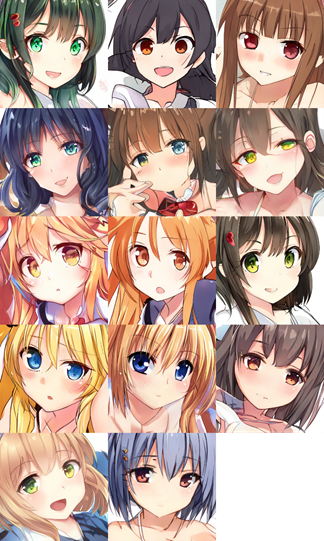
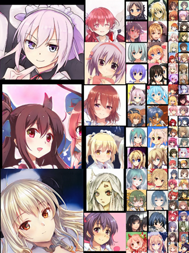
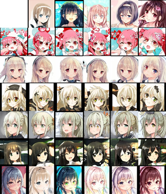
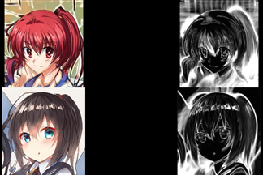
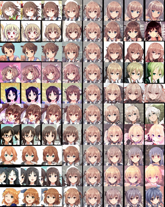

# avvg
anime vvife avatar generator
## 实验环境
根据NVIDIA StyleGAN GitHub的说明，最低环境要求为：
- Both Linux and Windows are supported, but we strongly recommend Linux for performance and compatibility reasons.
- 64-bit Python 3.6 installation. We recommend Anaconda3 with numpy 1.14.3 or newer.
- TensorFlow 1.10.0 or newer with GPU support.
- One or more high-end NVIDIA GPUs with at least 11GB of DRAM. We recommend NVIDIA DGX-1 with 8 Tesla V100 GPUs.
- NVIDIA driver 391.35 or newer, CUDA toolkit 9.0 or newer, cuDNN 7.3.1 or newer.

我个人的实验平台和环境为：
- CPU: Intel(R) Xeon(R) Gold 5218R CPU @2.10GHz
- RAM: 64 GB
- NVIDIA RTX 3090 - 24GB
- Ubuntu 20.04 LTS
- Miniconda: python 3.8, numpy, pillow, requests, tensorboard
- TensorFlow  1.15.5, Cuda  11.4

## 数据集下载

二者任选其一即可

- [Danbooru2020](https://www.gwern.net/Danbooru2020): 需要自行预处理，具体操作见数据集处理节
- 我处理好的自制数据集: 不用预处理，可直接使用
    - [GDrive](https://drive.google.com/file/d/1rC09fzNTQSD7skLoaLG_g39ggbTyRj43/view?usp=sharing)
    - [Baidu: ifdj](https://pan.baidu.com/s/1dQhHeCZp5U0TSoAQEVTmzA?pwd=ifdj)
    - SHA-256: 87ff13a8dde2358eae29f52f079eb5de06ae1027639500701304d733085fec47

## 运行方式
### 数据集处理
#### 使用Danbooru2020原始数据集

```shell
rsync --verbose --recursive rsync://176.9.41.242:873/danbooru2020/ danbooru2020/
```

下载数据集，大小为3.4TB，注意存储空间大小。下文中默认该数据集放在项目工作目录下。

```shell
cd AnimeWifeGenerator/dataset_prepare
```

使用如下的shell脚本运行裁剪人脸:

```shell
detectandcrop () {
BUCKET=$(printf "%04d" $(( $@ % 1000 )) )
ID="$@"
CUDA_VISIBLE_DEVICES ="0" python AnimeWifeGenerator/dataset_prepare/lbpcascade_animeface/examples/detect.py \ AnimeWifeGenerator/dataset_prepare/lbpcascade_animeface/lbpcascade_animeface.xml \ AnimeWifeGenerator/danbooru2020/original/$BUCKET/$ID .* "AnimeWifeGenerator/Danbooru2020_part_dc/$ID"
}
export -f detectandcrop

mkdir AnimeWifeGenerator/Danbooru2020_part_dc/
find AnimeWifeGenerator/danbooru2020/original/ -type f -name "*. jpg" | parallel detectandcrop
```

执行下述shell脚本清理空白、低质量和冗余的图片:

```shell
find AnimeWifeGenerator/Danbooru2020_part_dc/ -size 0 -type f -delete

find AnimeWifeGenerator/Danbooru2020_part_dc/ -size -100k -type f -delete

fdupes –delete –omitfirst –noprompt AnimeWifeGenerator/Danbooru2020_part_dc/

```

执行下述shell脚本使用waifu2x放大图片:

```shell
upscaleimages () {
SIZE1=$(identify -format "%h" "$@")
SIZE2=$(identify -format "%w" "$@");

if (( $SIZE1 < 512 && $SIZE2 < 512)); then
    echo "$@" $SIZE
    TMP=$(mktemp "/tmp/XXXXXX.png")
    CUDA_VISIBLE_DEVICES ="0" AnimeWifeGenerator/dataset_prepare/waifu2x/waifu2x.lua -model_dir \ AnimeWifeGenerator/dataset_prepare/waifu2x/models/upconv_7/art -tta 1 -m scale -scale 2 \
    -i "$@" -o "$TMP"
    convert "$TMP" "$@"
    rm "$TMP"
fi;}

export -f upscaleimages
find AnimeWifeGenerator/Danbooru2020_part_dc/ -type f | parallel upscaleimages
```

将所有的图片转换为JPG和RGB颜色:

```shell
find AnimeWifeGenerator/Danbooru2020_part_dc/ -type f \
mogrify -resize 512x512\

find AnimeWifeGenerator/Danbooru2020_part_dc/ -type f \
fgrep -v “JPEG 512x512 512x512+0+0 8bit sRGB”

```

#### 使用我处理好的数据集

如果嫌麻烦不想花时间处理数据集，可以直接下载我处理好的数据集解压即可使用：

- [GDrive](https://drive.google.com/file/d/1rC09fzNTQSD7skLoaLG_g39ggbTyRj43/view?usp=sharing)
- [Baidu: ifdj](https://pan.baidu.com/s/1dQhHeCZp5U0TSoAQEVTmzA?pwd=ifdj)
- SHA-256: 87ff13a8dde2358eae29f52f079eb5de06ae1027639500701304d733085fec47

处理好的数据集并不能直接用于训练，需要使用NVIDIA StyleGAN提供的data_tool.py脚本转换为tensorflow可识别的格式:

```shell
cd AnimeWifeGenerator/
conda activate tf15

python3 dataset_tool.py create_from_images AnimeWifeGenerator/dataset_tf AnimeWifeGenerator/Danbooru2020_part_dc
```

转换格式需要很长的时间，原来的数据集大小为11.2GB，转换为`.tFRecords`的StyleGAN可识别的数据集大小为296GB。

## 运行方式

训练：

```shell
cd AnimeWifeGenerator/
python3 train.py
```

也可以下载我训练好的模型放入`AnimeWifeGenerator/trained_network/`使用：

- [GDrive](https://drive.google.com/file/d/1xtT2RHkBM27D93QtvCPCN7_iHA6m4VH9/view?usp=sharing)
- [Baidu: 894f](https://pan.baidu.com/s/10ftK_Gf7i49YPV7dAOEnUg?pwd=894f)
- SHA-256: ae96ea3d0a8a32c2b63939a1e9b17b3478aa61d6632867309c43afb66fcbb98d

生成样本：

```shell
cd AnimeWifeGenerator/
python3 pretrained_example.py
```

`AnimeWifeGenerator/generated/pictures/`目录下即可发现刚才生成的样本。

生成图片：

```shell
cd AnimeWifeGenerator/
python3 generate_figures.py
```

`AnimeWifeGenerator/generated/figures/`目录下即可发现刚刚生成的图片。

## 实验结果












